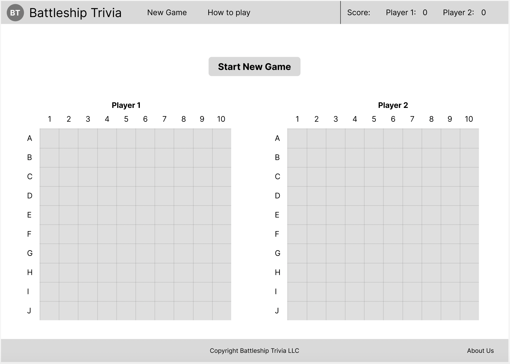
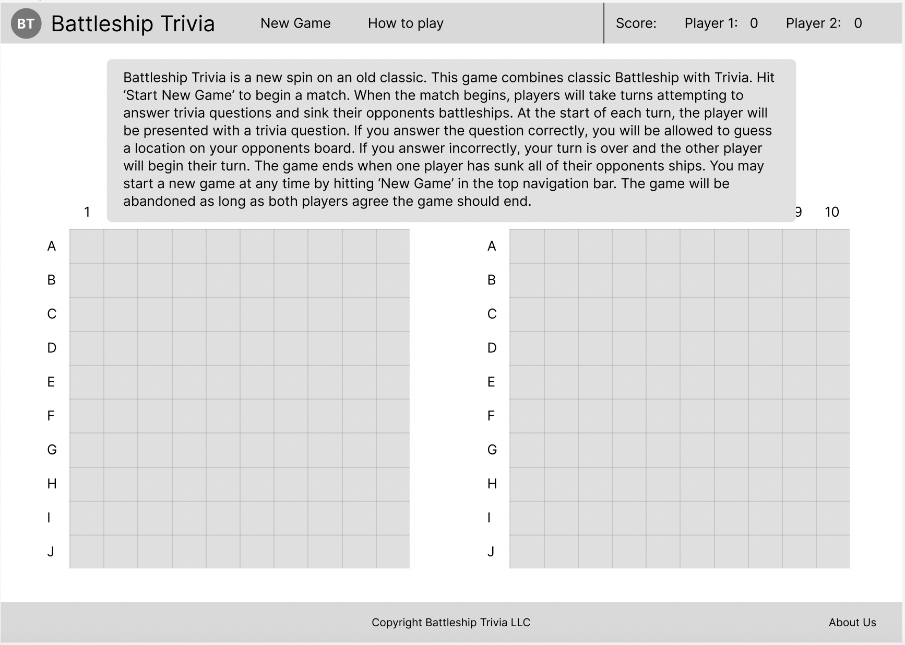
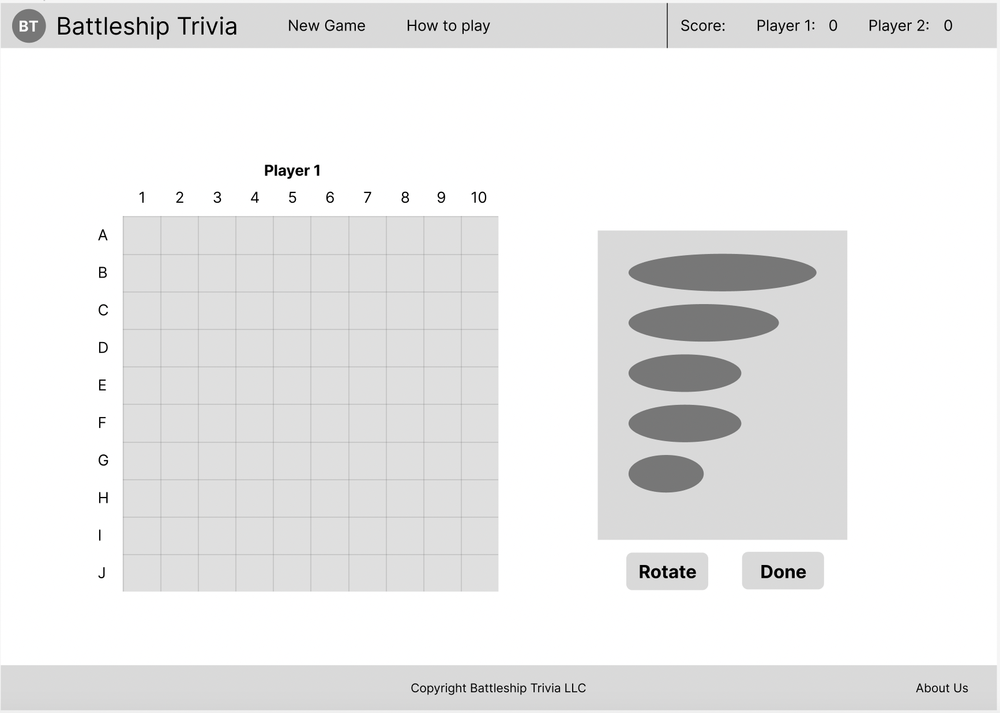
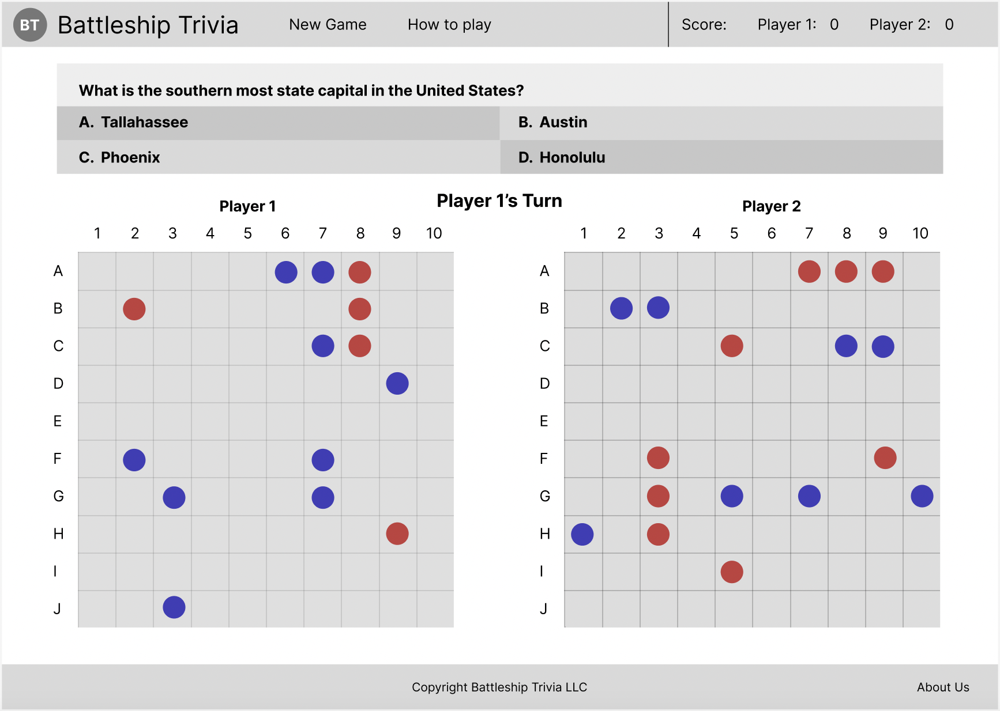
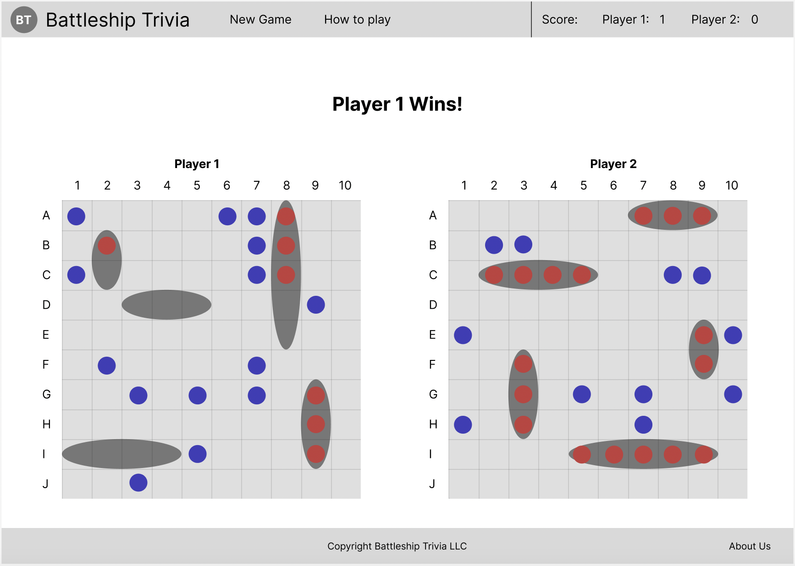

# Battleship Trivia

## Background

I built this game to combine one of my favorite games from my childhood (Battleship) with my favorite game as an adult (Trivia). Battleship in particular has a fair amount of compexity in making sure ship set-up functions properly and doesn't break any rules, so this felt like a great first project in putting JavaScript to work.

## How-to-Play

 Battleship Trivia is a new spin on an old classic. This game combines classic Battleship with Trivia. First, each player will set up their ships like in standard battleship. Next, the players will take turns guessing squares to find and sink their opponent's ships. In this version, the twist is that after getting a succesful hit on an opponent's ship, the current player will be given a trivia question. If they answer the question correctly, they will be able to guess another square. This can continue as long as a player keeps getting hits and answering questions correctly. If a question is answered incorrectly, it's the end of the players turn and the game continues. The winner is the player that sinks all of their opponent's ships first.

## Play the Game

[Play here.](https://battleship-trivia.vercel.app/) Game hosted by Vercel. 

## Technologies Used

- Javascript
- JSON
- HTML5
- CSS

## Wireframe Screenshots

### Start Screen

### How-to-Play Screen

### Ship Setup Screen

### Mid-game Screen

### End-game Screen

## User Stories

#### MVP Goals

- As a player, I would like a how-to-play screen to explain the game format, rules and objectives
- As a player, I want my game to recognize when battleships are hit by myself and my opponent and update the game state visually.
- As a player, I would like to be informed when the game is over due to all ships being sunk.
- As a player, I would like to know whose turn it is so that I don't have to keep track.
- As a player, I would like to be informed with some indication when I make a guess of an opponents ship location and whether it is a hit or a miss
- As a player, I would like to be informed with some indication when my opponent makes a guess of my ships' locations and whether it is a hit or a miss
- As a player who requires assistive technologies, I would like accessibility features so that I'm not left out of enjoying the game.
- As a player I would like to be able to restart the game after a win or loss (look at just disabling New Game button until game is over)
- As a player, I want the UI to be engaging and out of the way so that I enjoy the experience of playing the game.
- As a player, I would like the trivia portion of the game be clearly presented, and let me know if I got the answer right. If I got the answer wrong, it should show me what the correct answer was.
- As a player, I would like a scoreboard to track my wins and losses over the course of a session. 

#### Stretch Goals

- As a player, I would like a victory animation when I win the game, so that I feel good about my victory!
- As a player, I would like to hear an audible sound when I make a guess. The sound should also change based on a hit or a miss.
- As a player, I would like to play this game online so that I don't have to have my challenger sitting next to me.
- As a player, I would like to be able to change to an alternate game mode that changes the way the trivia aspect influeces the game
- As a player, I would like to be able to abandon a game and start again in the same session if both my opponent and I agree to a restart
- As a player, I would like to be able to choose a certain category for the trivia used in game, or play with random categories. I would like the art of the game to update based on the category chosen

## Timeline

| Day       |   | Task                                                              | Status     | Notes                                      |
|-----------|---|-------------------------------------------------------------------|------------|--------------------------------------------|
| Sunday    |   | Create proposal, make wireframes of each game state               | Completed  |                                            |
| Monday    |   | Create HTML, CSS, JS files with basic scaffolding                 | Completed  |                                            |
| Tuesday   |   | Add functionality for setting ships and making guesses            | Completed  |                                            |
| Wednesday |   | Add content and styling, this includes battleships themselves     | Completed  | Some functionality was completed Wednesday |
| Thursdary |   | Continue with styling and add trivia functionality and JSON files | Completed  |                                            |
| Friday    |   | Finalize MVP, clean code, breakout functions                      | Completed  |                                            |
| Saturday  |   | Work on stretch goals, particularly a database for the trivia     | Incomplete |                                            |
| Sunday    |   | Finalize work on stretch goals, go through final user testing     | Completed  | Had friends play game to get feedback      |
| Monday    |   | Present work                                                      |            |                                            |

Further tracking of goals and tasks was managed on [this Trello board.](https://trello.com/b/pFpab8LH/battleship-trivia)

## Attributions

  - Images:
    * iconfinder PNGs
  - Fonts: 
    * Google Fonts: [Cantarell](https://fonts.google.com/specimen/Cantarell)

## Next Steps

- Program an AI to play against (and give it some ruleset for how often it correctly answers trivia questions)
- Improve art design, and make the design change depending on the trivia category selected
- Store trivia questions in a database, and connect that database to the front-end deployment